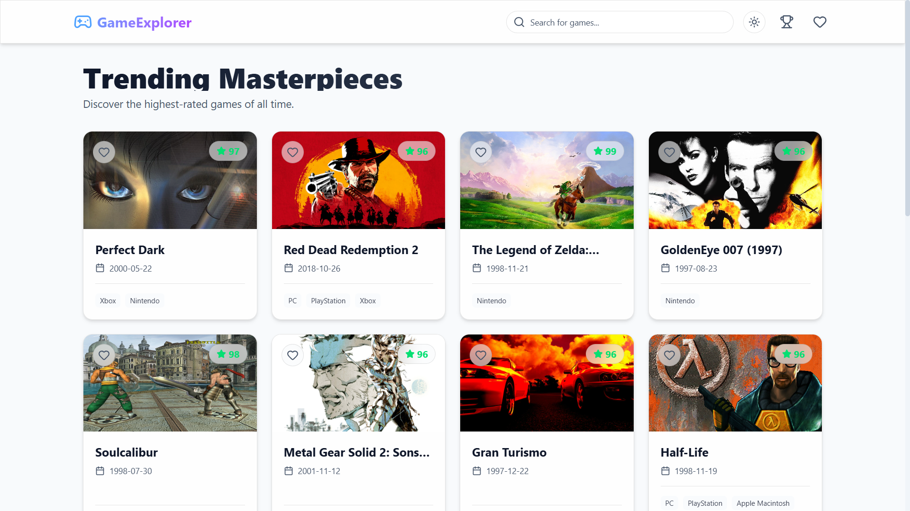

# 🎮 Game Explorer

A modern, dynamic web application to discover, search, and explore video games. Built with React, Tailwind CSS, and the RAWG Video Games Database API.

## ✨ Features

- **Discover New Games**: Browse through popular and highly-rated games — the trending list shuffles on every visit, so you always discover something new.
- **"Guess the Game" Trivia Quiz 🏆**: An arcade-style survival game to test your gaming knowledge!
  - **Survival Mode ❤️**: Start with 3 lives — wrong answers or timeouts cost a life.
  - **Countdown Timer ⏱️**: Think fast with a 15-second shrinking countdown timer per round.
  - **Streak Multiplier 🔥**: Maintain consecutive correct answers to multiply score earnings.
  - **Dynamic Clues 🔍**: Guess from blurred gameplay screenshots (can be de-blurred with a 3-second penalty), release years, metacritic scores, genres, and platform tags.
  - **High Score Record 👑**: Keeps track of your personal high score locally using LocalStorage.
- **Search Functionality**: Quickly find specific games using the search bar.
- **My Library / Wishlist**: Save your favorite games locally to view them later in a dedicated library page.
- **Detailed Information**: View comprehensive details for each game, including ratings, release dates, and platforms.
- **Similar Games**: Discover related games through a "You Might Also Like" carousel — automatically suggests games from the same series or genre.
- **Infinite Scroll**: Seamlessly browse through hundreds of games — new content loads automatically as you scroll down, no pagination buttons needed.
- **Skeleton Loading**: Premium shimmer-effect placeholder cards appear while content loads, providing a smooth and polished loading experience.
- **Scroll to Top**: A sleek, animated button appears at the bottom-right corner as you scroll down — one click smoothly takes you back to the top.
- **Premium UI/UX**: Enjoy a sleek, dark-themed design with smooth micro-interactions.
- **Fluid Animations**: Seamless page transitions and interactive elements powered by Framer Motion.
- **Responsive Design**: Fully optimized for mobile, tablet, and desktop devices.

## 🛠️ Tech Stack

- **Frontend Framework**: React.js (v19) with Vite
- **Styling**: Tailwind CSS (v4)
- **Animations**: Framer Motion
- **Routing**: React Router v7
- **Data Fetching**: Axios
- **Icons**: Lucide React
- **API**: [RAWG API](https://rawg.io/apidocs)

## 
🚀 Demo You can try **Game-Explorer** live here: [](https://game-explorer-pink.vercel.app/)
## Screenshot



## 🚀 Getting Started

Follow these instructions to run the project locally on your machine.

### Prerequisites

- Node.js (v18 or higher recommended)
- npm, yarn, or pnpm

### Installation

1. **Clone the repository**
   ```bash
   git clone https://github.com/CodeByTinku/Game-Explorer.git
   cd Game-Explorer
   ```

2. **Install dependencies**
   ```bash
   npm install
   ```

3. **Set up Environment Variables**
   - Copy the `.env.example` file to create a new `.env` file in the root directory.
   - Get your free API key from [RAWG](https://rawg.io/apidocs).
   - Add your API key to the `.env` file:
     ```env
     VITE_API_KEY=your_rawg_api_key_here
     ```
 

4. **Start the development server**
   ```bash
   npm run dev
   ```

5. **Open the app**
   Visit `http://localhost:5173` in your browser.


## 🤝 Contributing

Contributions, issues, and feature requests are welcome! Feel free to check the [issues page](https://github.com/CodeByTinku/Game-Explorer/issues).

## 📄 License

This project is open-source and available under the [MIT License](LICENSE).

---
*Designed and built by [Tinku](https://github.com/CodeByTinku)*
